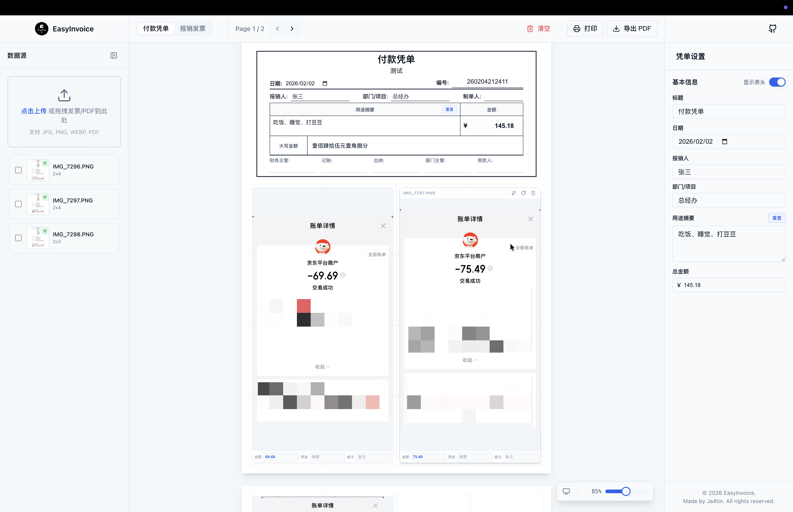

# EasyInvoice 智能报销排版工具

## 🌩 这是一个纯 Vibe Coding 完成的项目

一款纯客户端、隐私优先的 React 报销排版工具。EasyInvoice 让您无需繁琐地在 Word/Excel 中手动拖拽图片，即可一键生成标准的 A4 报销粘贴单与发票打印页。

> **核心特性**: 离线优先、隐私安全（无后端存储）、智能排版、一键 PDF 导出。



## ✨ 功能特性 (Features)

*   **⚡️ 智能自动排版**: 告别手动对齐。内置“自动填坑”算法，根据图片尺寸（2x2, 2x4 等）自动在 A4 网格中寻找最佳位置进行紧密排列。
*   **🙈 隐私保护 (Privacy First)**: 采用 **Serverless** 纯前端架构。您的所有财务数据、发票图片仅存储在您本地浏览器的 IndexedDB 中，绝不会上传至任何服务器。
*   **📄 A4 标准输出**:
    *   **付款凭单模式**: 自动生成标准财务付款凭单头部（包含大写金额自动转换、摘要汇总），并预留签字区域，发票附后排列。
    *   **纯发票模式**: 适配“田字格”或“上下分栏”布局，适合批量打印电子发票。
*   **🛠️ 强大的编辑器**:
    *   **拖拽排序**: 在左侧列表或中间画布随意拖拽调整发票顺序。
    *   **图片处理**: 支持裁剪、旋转、亮度调节。上传时自动压缩大图，流畅不卡顿。
    *   **PDF 解析**: 支持直接上传 PDF 电子发票，自动提取每页为独立图片。
*   **🖨️ 高清导出**: 基于 `Canvas Scale` 技术实现 300 DPI 高清 PDF 导出/打印，确保打印出来的二维码即使缩放也清晰可扫。

## 🛠️ 技术栈 (Tech Stack)

本项目采用 2026 年现代 React SPA 标准架构，注重性能与维护性。

| 模块 | 选型 | 说明 |
| :--- | :--- | :--- |
| **构建工具** | **Vite** | 极速冷启动与热更新 (HMR)。 |
| **核心框架** | **React 18 + TypeScript** | 强类型安全，利用 Hooks 处理复杂交互逻辑。 |
| **样式方案** | **Tailwind CSS** | 原子化 CSS，精确控制打印样式与响应式布局。 |
| **UI 组件** | **shadcn/ui** | 基于 Radix UI 的无头组件，美观且无运行时体积负担。 |
| **状态管理** | **Zustand** | 轻量级状态管理，结合 `idb-keyval` 实现 IndexedDB 持久化。 |
| **核心算法** | **dnd-kit** | 现代化的拖拽库，支持网格与列表的双向同步。 |
| **PDF 生成** | **html2canvas + jspdf** | 采用“DOM 克隆+替换”策略实现所见即所得的高清导出。 |

## 📂 项目结构 (Structure)

采用 **Feature-based** 架构，按业务领域组织代码，易于扩展。

```text
src/
├── assets/             # 静态资源
├── components/         # 全局通用 UI 组件 (基于 shadcn/ui)
│   ├── ui/             # Button, Input, Dialog 等基础组件
│   └── Layout.tsx      # 全局三栏布局组件
├── features/           # 核心业务模块
│   ├── editor/         # [核心] 编辑器模块
│   │   ├── components/ # GridCanvas (画布), Sidebar (列表) 等
│   │   ├── hooks/      # useGridLayout (排版算法), useExportPdf
│   │   └── utils/      # 核心算法 (自动填坑、分页逻辑)
│   ├── upload/         # 上传模块 (Dropzone, PDF解析)
│   └── voucher/        # 凭单模块 (金额计算, 摘要汇总)
├── store/              # 全局状态管理
│   ├── useInvoiceStore.ts # 核心数据源 (Actions & State)
│   └── storage.ts         # IndexedDB 适配器
├── lib/                # 工具库 (utils, db)
└── App.tsx             # 入口组件
```

## 🚀 快速开始与部署 (Deployment)

由于是纯静态单页应用 (SPA)，您可以将其部署在任何静态托管服务上。

### 本地开发

1.  **克隆项目**:
    ```bash
    git clone https://github.com/your-username/EasyInvoice.git
    cd EasyInvoice
    ```

2.  **安装依赖**:
    ```bash
    npm install
    # 或
    pnpm install
    ```

3.  **启动开发服务器**:
    ```bash
    npm run dev
    ```
    访问 `http://localhost:5173` 即可预览。

### 生产环境构建

1.  **执行构建**:
    ```bash
    npm run build
    ```
    构建产物将输出到 `dist/` 目录。

2.  **部署**:
    *   **Vercel / Netlify (推荐)**: 关联 GitHub 仓库，设置 Build Command 为 `npm run build`，Output Directory 为 `dist` 即可自动部署。
    *   **Nginx / Apache**: 将 `dist` 目录上传至服务器 web 根目录。
    *   **Docker**: 可参考 standard nginx `Dockerfile` 进行容器化部署。

## 📄 许可证 (License)

MIT License
